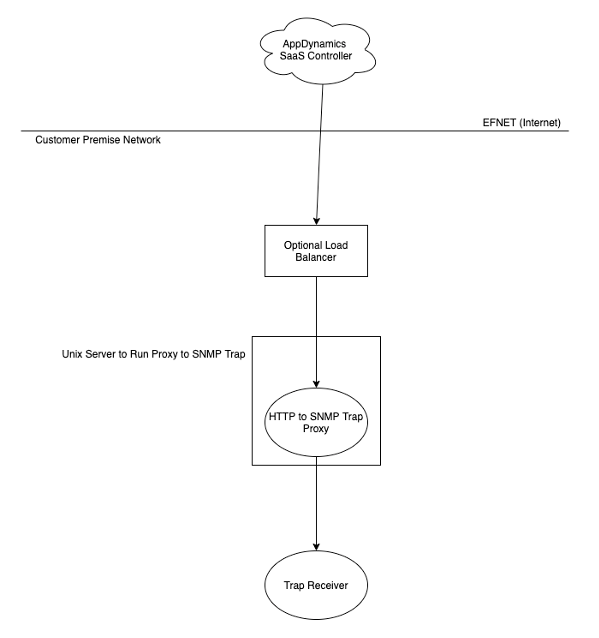
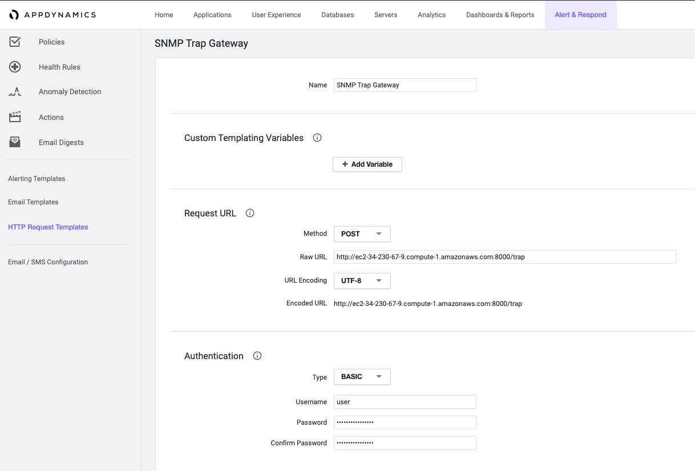
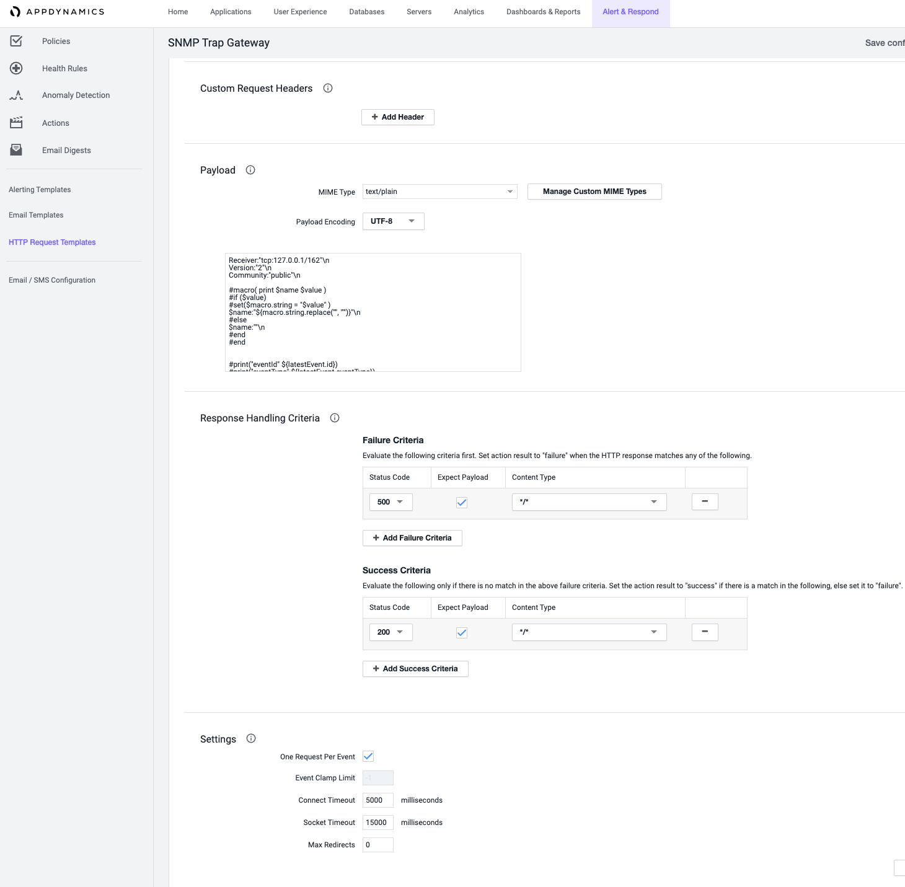

# AppDynamics HTTP->SNMPTrap Gateway

In order to support sending SNMP traps as an action from AppDynamics SaaS Controllers, we require a proxy running on the customer’s premise network that can fire traps in response to Policy Actions during a Health Rule Violation or Event on the SaaS Controller. To facilitate this, a proxy is needed that can take a request from the controller and send it on as an SNMP trap. The goal of this work effort is to produce just such a proxy, test it for functional capability, and assist the customer in deploying it on premise.

## Customer Requirements ##
Ensure that the SNMP Trap forwarder works for the customer, it must conform to the following requirements:
1.	It must be freestanding, and not require any custom hardware or software, where possible
2.	It must support SSL encryption on the public facing web listener
3.	It must support SNMP V2 traps, version 1 isn’t needed, but wouldn’t hurt as a fallback
4.	It must support at least one userid and password for authentication
5.	Must support sending to multiple receivers for high availability

## Design ##

In order to deliver a server quickly, we will make use of standard Java 1.8 JVM with an external library to assist in the SNMP trap generation. The high level design is very basic, a java program will listen on a port for HTTP requests and as requests are received, they will be parsed and forwarded as SNMP traps to the receiver configured in the request. We will be dependent on the external library: snmp4j v 2.8.4



## How to Execute ##
To run the proxy, it must be executed with a command simliar to:
```
    java -jar WebRestToSNMP-1.3.jar config.properties
```

## Configuration ##
the config.properties file looks like the following example:
```
#server port needs to be >1024 if not root, and should definitely be not root
serverPort=8000
#simple http auth requirement for /trap url; /mib and /action are not authenticated, as they are static information urls
authRequired=false
authUser=user
authPassword=secret
#keytool -genkeypair -keyalg RSA -alias selfsigned -keystore testkey.jks -storepass password -validity 360 -keysize 2048
useSSL=false
sslContext=TLS
keystoreInstance=JKS
keystorePassword=password
keystoreFile=testkey.jks
keyManagerFactory=SunX509
trustManagerFactory=SunX509
#shouldn't need to mess with these, but just in case....
threadPoolMaxSize=8
threadPoolKeepAliveSeconds=30
threadPoolCapacity=100
```

## AppDynamics Controller Configuration ##
The Controller needs to be configured with a custom HTTP Request Template, like the following example



The Payload of the request should match this, with the Receiver section updated to specify the snmp receiver ipaddress and port on the customer's network:
```
Receiver:"tcp:ipaddress/port"\n
Receiver:"tcp:ipaddress/port"\n
Version:"2"\n
Community:"public"\n

#macro( print $name $value )
#if ($value)
#set($macro.string = "$value" )
$name:"${macro.string.replace('"', "'")}"\n
#else
$name:""\n
#end
#end


#print("eventId" ${latestEvent.id})
#print("eventType" ${latestEvent.eventType})
#print("guid" ${latestEvent.guid})
#print("eventTypeKey" ${latestEvent.eventTypeKey})
#print("eventTimeStamp" ${latestEvent.eventTime})
#print("displayName" ${latestEvent.displayName})
#print("summaryMessage" ${latestEvent.summaryMessage})
#print("eventMessage" ${latestEvent.eventMessage})
#print("applicationId" ${latestEvent.application.id})
#print("applicationName" ${latestEvent.application.name})
#print("tierId" ${latestEvent.tier.id})
#print("tierName" ${latestEvent.tier.name})
#print("nodeId" ${latestEvent.node.id})
#print("nodeName" ${latestEvent.node.name})
#print("databaseId" ${latestEvent.db.id})
#print("databaseName" ${latestEvent.db.name})
#print("severity" ${topSeverity})
#print("severityImageURL" ${topSeverityImage.deepLink})
#print("accountName" $account.name)
#print("policyName" $policy.name)
#print("actionName" ${action.name})
#print("controllerUrl" ${controllerUrl})
#print("deepLink" ${latestEvent.deepLink})
#print("notes" ${notes})

#foreach( ${value} in ${fullEventsNodeMap.values()} )
   #print("machineName" ${value.machineName} )
   #print("ipAddresses" ${value.ipAddresses} )
#end

```
This can also be accessed by simply pointing a web browser to the proxy gateway host with url /action

## SNMP Trap Receiver MIB ##
The customer's on-premise SNMP Trap Receiver should have the proxy gateway MIB compiled and imported to support the traps being sent from it. This can also be retrieved from the proxy with a web browser pointing to the URI /mib
```
AppDynamics-TRAP-MIB DEFINITIONS ::= BEGIN

IMPORTS
  MODULE-IDENTITY, enterprises,
  OBJECT-TYPE, NOTIFICATION-TYPE, Integer32,
  Counter64
     FROM SNMPv2-SMI
   OBJECT-GROUP, NOTIFICATION-GROUP
       FROM SNMPv2-CONF;

appdynamics MODULE-IDENTITY
   LAST-UPDATED "202012110000Z"
   ORGANIZATION "AppDynamics Cisco"
   CONTACT-INFO
       "AppDynamics
       Author: John.Southerland@appdynamics.com or josouthe@cisco.com
       Last Ditch Email: it@appdynamics.com"

   DESCRIPTION
       "This MIB contains the definition of the SNMP Traps associated with Events and Health Rule Violations
       sent by the AppDyanmics Controller -> REST Web Proxy -> a trap receiver.

       This will need to be imported into your own trap receiver software in order to map the OIDs to values"

   REVISION "202009100000Z"
   DESCRIPTION "First Revision, John Southerland john.southerland@appdynamics.com"
   REVISION "202012110000Z"
   DESCRIPTION "Second Revision, John Southerland john.southerland@appdynamics.com; corrected mibile to mobile name; added machine name CSV list and ipaddress CSV list"

::= { enterprises 40684 }

events OBJECT IDENTIFIER ::= { appdynamics 138 }

eventsTable OBJECT-TYPE
   SYNTAX  SEQUENCE OF EventEntry
   MAX-ACCESS          not-accessible
   STATUS              current
   DESCRIPTION         "table of events triggered from AppDynamics Controller"
   ::= { events 1 }

eventEntry  OBJECT-TYPE
   SYNTAX              EventEntry
   MAX-ACCESS          not-accessible
   STATUS              current
   DESCRIPTION         "data structure for an event object"
   INDEX               { eventId }
   ::= { eventsTable 1 }


EventEntry  ::= SEQUENCE {
   eventId             OCTET STRING,
   eventType           INTEGER,
   guid                OCTET STRING,
   eventTypeKey        OCTET STRING,
   eventTimeStamp      OCTET STRING,
   displayName         OCTET STRING,
   summaryMessage      OCTET STRING,
   eventMessage        OCTET STRING,
   applicationName     OCTET STRING,
   applicationId       INTEGER,
   tierName            OCTET STRING,
   tierId              INTEGER,
   nodeName            OCTET STRING,
   nodeId              INTEGER,
   databaseName        OCTET STRING,
   databaseId          INTEGER,
   severity            INTEGER,
   severityImageURL    OCTET STRING,
   accountName         OCTET STRING,
   policyName          OCTET STRING,
   actionName          OCTET STRING,
   controllerURL       OCTET STRING,
   deepLinkURL         OCTET STRING,
   notes               OCTET STRING,
   eventTypeString     OCTET STRING,
   eventSubTypeString  OCTET STRING,
   machineNameList     OCTET STRING,
   ipAddressList       OCTET STRING
}

eventId  OBJECT-TYPE
   SYNTAX  OCTET STRING
   MAX-ACCESS  read-only
   STATUS  current
   DESCRIPTION "ID of event in controller"
   ::= { eventEntry 1 }

eventType   OBJECT-TYPE
   SYNTAX    INTEGER {
         healthRuleViolationEvent (1),
         anomalyViolationEvent (2),
         slowTransactionEvent (3),
         codeProblemEvent (4),
         applicationChangeEvent (5),
         serverCrashEvent (6),
         appDynamicsConfigWarningEvent (7),
         discoveryEvent (8),
         syntheticAvailabilityEvent(9),
         syntheticPerformanceEvent(10),
         mobileCrashEvent(11),
         errorEvent(12),
	   unknownEvent(13)
      }
   MAX-ACCESS read-only
   STATUS    current
   DESCRIPTION "The type of event to forward."
   ::= { eventEntry 2 }

guid OBJECT-TYPE
   SYNTAX  OCTET STRING
   MAX-ACCESS  read-only
   STATUS  current
   DESCRIPTION "GUI of event in controller"
   ::= { eventEntry 3 }

eventTypeKey OBJECT-TYPE
   SYNTAX  OCTET STRING
   MAX-ACCESS  read-only
   STATUS  current
   DESCRIPTION "event type description"
   ::= { eventEntry 4 }

eventTimeStamp OBJECT-TYPE
   SYNTAX  OCTET STRING
   MAX-ACCESS  read-only
   STATUS  current
   DESCRIPTION "timestamp of event"
   ::= { eventEntry 5 }

displayName OBJECT-TYPE
   SYNTAX  OCTET STRING
   MAX-ACCESS  read-only
   STATUS  current
   DESCRIPTION "descriptive name of event"
   ::= { eventEntry 6 }

summaryMessage OBJECT-TYPE
   SYNTAX  OCTET STRING
   MAX-ACCESS  read-only
   STATUS  current
   DESCRIPTION "summary text message of event"
   ::= { eventEntry 7 }

eventMessage OBJECT-TYPE
   SYNTAX  OCTET STRING
   MAX-ACCESS  read-only
   STATUS  current
   DESCRIPTION "detailed message of event"
   ::= { eventEntry 8 }

applicationName OBJECT-TYPE
   SYNTAX  OCTET STRING
   MAX-ACCESS  read-only
   STATUS  current
   DESCRIPTION "appd application name"
   ::= { eventEntry 9 }

applicationId OBJECT-TYPE
   SYNTAX  INTEGER
   MAX-ACCESS  read-only
   STATUS  current
   DESCRIPTION "appd application id"
   ::= { eventEntry 10 }

tierName  OBJECT-TYPE
   SYNTAX  OCTET STRING
   MAX-ACCESS  read-only
   STATUS  current
   DESCRIPTION "appd tier name"
   ::= { eventEntry 11 }

tierId OBJECT-TYPE
   SYNTAX  INTEGER
   MAX-ACCESS  read-only
   STATUS  current
   DESCRIPTION "appd tier id"
   ::= { eventEntry 12 }

nodeName  OBJECT-TYPE
   SYNTAX  OCTET STRING
   MAX-ACCESS  read-only
   STATUS  current
   DESCRIPTION "appd node name"
   ::= { eventEntry 13 }

nodeId  OBJECT-TYPE
   SYNTAX  INTEGER
   MAX-ACCESS  read-only
   STATUS  current
   DESCRIPTION "appd node id"
   ::= { eventEntry 14 }

databaseName  OBJECT-TYPE
   SYNTAX  OCTET STRING
   MAX-ACCESS  read-only
   STATUS  current
   DESCRIPTION "appd database name"
   ::= { eventEntry 15 }

databaseId  OBJECT-TYPE
   SYNTAX  INTEGER
   MAX-ACCESS  read-only
   STATUS  current
   DESCRIPTION "appd database id"
   ::= { eventEntry 16 }

severity  OBJECT-TYPE
   SYNTAX  INTEGER {
       info (1),
       warning (2),
       critical (3)
   }
   MAX-ACCESS  read-only
   STATUS  current
   DESCRIPTION "severity of event"
   ::= { eventEntry 17 }

severityImageURL  OBJECT-TYPE
   SYNTAX  OCTET STRING
   MAX-ACCESS  read-only
   STATUS  current
   DESCRIPTION "fun little image to go with severity"
   ::= { eventEntry 18 }

accountName  OBJECT-TYPE
   SYNTAX  OCTET STRING
   MAX-ACCESS  read-only
   STATUS  current
   DESCRIPTION "appd account name"
   ::= { eventEntry 19 }

policyName   OBJECT-TYPE
   SYNTAX  OCTET STRING
   MAX-ACCESS  read-only
   STATUS  current
   DESCRIPTION "appd policy name"
   ::= { eventEntry 20 }

actionName   OBJECT-TYPE
   SYNTAX  OCTET STRING
   MAX-ACCESS  read-only
   STATUS  current
   DESCRIPTION "appd action name"
   ::= { eventEntry 21 }

controllerURL  OBJECT-TYPE
   SYNTAX  OCTET STRING
   MAX-ACCESS  read-only
   STATUS  current
   DESCRIPTION "appd controller url for linking back to the UI"
   ::= { eventEntry 22 }

deepLinkURL  OBJECT-TYPE
   SYNTAX  OCTET STRING
   MAX-ACCESS  read-only
   STATUS  current
   DESCRIPTION "appd event url for linking back to the UI"
   ::= { eventEntry 23 }

notes  OBJECT-TYPE
   SYNTAX  OCTET STRING
   MAX-ACCESS  read-only
   STATUS  current
   DESCRIPTION "notes for this event"
   ::= { eventEntry 24 }

eventTypeString OBJECT-TYPE
   SYNTAX  OCTET STRING
   MAX-ACCESS  read-only
   STATUS  current
   DESCRIPTION "String Text of Event Type"
   ::= { eventEntry 25 }

eventSubTypeString OBJECT-TYPE
   SYNTAX  OCTET STRING
   MAX-ACCESS  read-only
   STATUS  current
   DESCRIPTION "Event Type has a subtype for many events, this is the raw text of that"
   ::= { eventEntry 26 }

machineNameList OBJECT-TYPE
   SYNTAX  OCTET STRING
   MAX-ACCESS  read-only
   STATUS  current
   DESCRIPTION "Comma Separated List of Machine Names impacted by this event, if any"
   ::= { eventEntry 27 }

ipAddressList OBJECT-TYPE
   SYNTAX  OCTET STRING
   MAX-ACCESS  read-only
   STATUS  current
   DESCRIPTION "Comma Separated List of IP Addresses for machines impacted by this event, if any; these may also include hostnames depending on the agent and version"
   ::= { eventEntry 28 }

eventNotification NOTIFICATION-TYPE
   OBJECTS {
       eventId,
       eventType,
       guid,
       eventTypeKey,
       eventTimeStamp,
       displayName,
       summaryMessage,
       eventMessage,
       applicationName,
       applicationId,
       tierName,
       tierId,
       nodeName,
       nodeId,
       databaseName,
       databaseId,
       severity,
       severityImageURL,
       accountName,
       policyName,
       actionName,
       controllerURL,
       deepLinkURL,
       notes,
       eventTypeString,
       eventSubTypeString,
	   machineNameList,
	   ipAddressList
   }
   STATUS current
   DESCRIPTION "alert notification, trap, for an event"
   ::= { events 2 }

END

```
